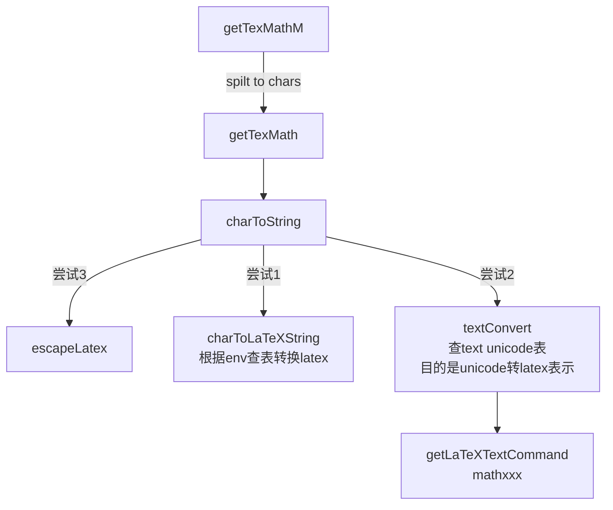
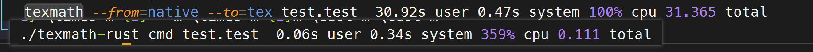

# texmath-Rust
texmath Rust实现版本

参考[texmath-haskell](https://github.com/jgm/texmath)

## 用法
设置好config.toml文件, 然后运行:
```bash
texmath-rust server
```


## 设计
```bash
src
├── ast
│ ├── mod.rs # AST定义
│ ├── ast_reader.rs # 读取AST -> Exp Node
│ ├── node.rs # AST Node定义
│ ├── tex_writer.rs # Exp Node -> TeX String
...
```
首先将native格式化为Node形式, 这一步比较简单, 因为native是LL(1)文法

第二步是把Exp Node转化为TeX String, 这一步比较复杂:

texmath-haskell使用了两次遍历, 即Exp Node -> Tex -> String
这样的设计是为了方便处理一些特殊情况, 比如:

- 空格处理:
  - 增加空格:
    ```text
    \alphax --> 
    \alpha x
    ```
  
    但\alpha\beta不需要加空格, 所以前一个元素需不需要加空格取决于后一个元素
  
  - 多空格合并:
    Space Space 变为单个空格, 因为Rel关系符号前后都需要空格, 如果下一个符号有前导空格, 则会出现两个空格的情况, 此时需要合并:

    ```text
    f(x) =  \leq 1 -->
    f(x) = \leq 1
    ```    
    其中"="和"\leq"之间有两个空格, 需要合并
  - 删除空格
    ```text
    \sum\limits --> limits后面的字符不需要空格
    ^, _ 不需要空格
    ```
    
- 多余Group嵌套:
    Group {Group{}} 变为单个Group{}, 在长Identifier需要默认加{}的情况出现, 如:
  ```text
  \mathbf{{text}} -->
  \mathbf{text}
  ```
  但是不能直接去掉所有的{}, 因为有些情况下需要{}, 如:
  ```text
  {base}^{exp}
  ```
  并且子表达式是否有{}不能靠开始和结束符号来判断, 比如:
  ```text
  {a}^{b}^{c}
  ```
  是一个没有{}的表达式, 它的两边却有{}的表达式, 所以texmath-haskell使用了两次遍历: 第一次遍历尽可能加{}, 第二次遍历除去{{}}的情况
  
### 符号转换
对于Unicode字符, amssymb, amsmath, 以及其他宏包的符号, 需要进行转换:


这里chars是unicode字符, 有三种情况:
1. 字面字符, 如: a, b, c
2. 转义字符, 如: \t, \n, \r
3. Unicode字符, 如: \u{2E00}, 存储的是\+十进制数

三个函数的作用:
- charToLaTeXString: 根据env查表转换latex命令, 如: [ -> \lbrack
- textConvert: 查text unicode表, 目的是转换特殊字符为latex表示, 如: 
```
"TextFraktur","C","\8493":
ℭ -> \mathfrak{C}
```
- escapeLatex: 转义Latex的特殊字符, 以便于Latex可以表示: $ -> \$

EText并不是这样转换, 直接使用unicode字符, 但是需要转义Latex的特殊字符

因为它是由\text{}包裹的, 所以不需要转义Latex的特殊字符

### 其他特殊情况
查看代码即可


### 优化
1. 两次遍历合并为一次遍历, 这样使得代码更加复杂, 但是可以减少一次遍历的开销
2. 使用全局buffer String, 减少局部String的创建分配

- 性能测试:

快500倍以上

### TODO
- [ ] 边界情况太多, Writer部分过于繁杂, 没有处理{{exp}}的情况
- [ ] 进行树的变换, 如ESuper (exp1) (null) -> exp1, 以减少节点数和writer压力以及优化写后的表达式, 避免出现exp1^{}{}^exp2这样的情况(应当为exp1^exp2)
- [ ] 优化AST Reader的match部分
- [ ] 在读取字符串时就把\1234这样的转义unicode转换为unicode单字符, 而不是等到转换时再转换
- [ ] 优化tex.push_text()的逻辑, 加快速度
- [ ] 整理代码(主要是合并shard.rs和tex_unicode.rs)
- [ ] 增加Benchmark测试和性能观测